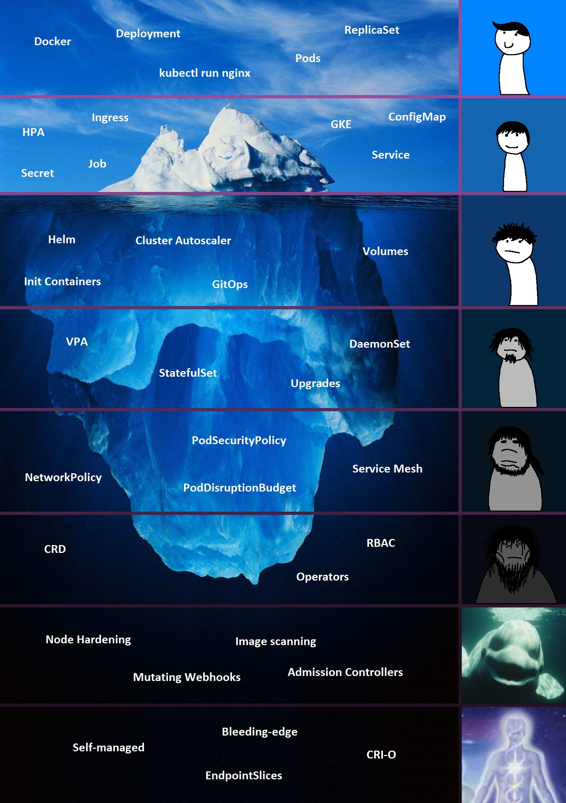

class: middle, center

# Getting Started with Kubernetes

---

# Agenda

- Kubernetes overview
	* Containers overview
	* Kubernetes architecture
- Kubernetes concepts
	* Pods
	* ReplicaSets
	* Deployments
- Services

---

.center[]

---

class:  middle, center

### To understand Kubernetes, we must first understand 2 things: Containers and Orchestration

---

class: middle, center

# What are containers?

---

# Containers

- Made up of Linux primitives
	* Cgroups
	* Namespaces
	* Linux Security Modules
	* Blah blah blah

---

# Containers

### Namespaces

Control what a process can see

- PID
- Mount
- Network
- IPC
- User
- Cgroup
- ...

---

# Containers

### Cgroups

Control what a process can use

- Memory
- CPU
- Blkio
- Devices
- Cpuset
- ...

---

# Containers

- Isolated environments
- As in, they can have their own processes, networks, mounts. Just like VM
- Except they share the same kernel

.center[]

.footnote[more info: https://opensource.com/resources/what-are-linux-containers]

---

# Containers

Linux containers have been around long before Docker

- OpenVZ
- LXC
- rkt
- runc
- ...

---

class: middle, center

# Why do you need containers?

---

# Why do you need containers?

- Compatibilities, dependencies
- Quick, repeatable
- Consistency

---

class: middle, center

# Container Orchestration

---

# Container orchestration

- Your application relies on other containers
- Number of users increases/decreses, how do you scale up or down?
- Blah blah blah

---

class: middle, center

### You need an underlying platform with resources and capabilities

---

# Containers orchestration technologies

- Docker Swarm
- Apache Mesos
- Kubernetes
- ...

---

# Advantages of containers orchestration

- Your app is now highly available, kinda
- User traffic is load-balanced across containers
- Scale containers up or down seamlessly
- Self-healing
- Upgrade or rollback applications
- Even scale the orchestration nodes themselves

---

class: middle, center

# Kubernetes

---

# What does "Kubernetes" mean?

#### Originates from Greek for "pilot" or "Helmsman of a ship"

.center[]

.footnote[How to pronounce: https://www.google.com/search?q=kubernetes+pronounce]

---

# What is Kubernetes?

- Also known as 'K8s'
- A production-grade open-source container orchestration system made by Google, based on Borg, systems that run inside of Google
- Google spawns billions of containers per week with these systems

.footnote[more info: https://kubernetes.io/docs/concepts/overview/what-is-kubernetes/]

---

# What is Kubernetes?

- All services within Kubernetes are natively load-balanced
- Can scale up and down dynamically
- Enables self-healing and seamless upgrading or rollback of applications

---

# Self-Healing

Kubernetes will __always__ try and steer the cluster to  its desired state

- Me: "I want 5 healthy instances of nginx to always be running"
- Kubernetes: "Ok, I will ensure there are always 5 instances up and running"
- Kubernetes: "Oh, one nginx has died. I'm going to try to spin up a new one"

---

# Kubernetes project

- Over 78,000+ stars on GitHub
- Over 3,000+ contributors to Kubernetes core

.footnote[more info: https://github.com/kubernetes]

---

# Kubernetes architecture

### When you deploy Kubernetes, you get a cluster

- Worker node(s) host the Pods
- Control plane manages the worker nodes and the Pods in the cluster

.footnote[more info: https://kubernetes.io/docs/concepts/overview/components/]

---

# Kubernetes Control Plane components

- kube-apiserver
- etcd
- kube-controller-manager
- kube-scheduler
- cloud-controller-manager (optional)

---

# Kubernetes Control Plane components

### kube-apiserver

- Provide interface into the control plane
- All clients and other applications interact with kubernetes through the API server

---

# Kubernetes Control Plane components

### etcd

- Acts as the cluster datastore
- Provide a strong, consistent, and highly available key-value store for persisting cluster state
- Stores objects and config information

.footnote[more info: https://etcd.io/]

---

# Kubernetes Control Plane components

### kube-controller-manager

- Monitors the cluster state and steers the cluster towards the desired state
- Some types of these controllers are:
	* Node controller: Responsible for noticing and responding when nodes go down
	* Replication controller: Responsible for maintaining the correct number of pods

---

# Kubernetes Control Plane components

### kube-scheduler

- Watches newly created pods with no node assigned and selects a node for them to run on
- With many factors taken into account for scheduling decisions

---

# Kubernetes Control Plane components

### cloud-controller-manager

- Lets you link your cluster into your cloud provider's API

---

# Node components

- kubelet
- kube-proxy
- Container runtime

---

# Node components

### kubelet

- Runs on each node in the cluster
- Makes sure that containers are running in a Pod
- Takes PodSpecs, ensures that the containers in those PodSpecs are running and healthy

---

# Node components

### kube-proxy

- Maintains the network rules on each node
- These network rules allow network communication to your Pods from inside or outside of your cluster

---

# Node components

### Container runtime

- Software that is resposible for running containers
	* Docker
	* containerd
	* cri-o
	* ...

---

.center[]

---

class: middle, center

# Kubernetes Concepts

---

# Something to keep you company

```console
$ git clone https://github.com/shinomineko/learn-k8s.git
```

And don't forget to read the README!

---

# Pods

- Smallest deployable units that you can create and manage in Kubernetes
- A group of one or more containers with shared storage and network resources

.footnote[more info: https://kubernetes.io/docs/concepts/workloads/pods/]

---

# Pods

```yaml
apiVersion: v1
kind: Pod
metadata:
  name: hello
spec:
  containers:
    - name: hello
      image: shinomineko/hello-service
```

---

# Pods

Each pod is meant to run a single instance of a given application. If you want to scale your
application horizontally, you should use multiple pods.

---

# ReplicaSets

- Maintain a stable set of replica Pods running at any give time

---

# ReplicaSets

```yaml
apiVersion: apps/v1
kind: ReplicaSet
metadata:
  name: hello-replicaset
  labels:
    app: hello
spec:
  template:
    metadata:
      name: hello-pod
      labels:
        app: hello
    spec:
      containers:
        - name: hello
          image: shinomineko/hello-service
  replicas: 3
  selector:
    matchLabels:
      app: hello
```

---

# Labels and Selectors

- Key-value pairs attached to objects, such as pods
- Can be used to organize and to select subsets of objects
	* `"environment": "dev"`, `"environment": "production"`
	* `"tier": "frontend"`, `"tier": "backend"`

.footnote[more info: https://kubernetes.io/docs/concepts/overview/working-with-objects/labels/]

---

# Deployments

- a higher-level concept that manages ReplicaSets
- Provide a lot of other useful features
	* Rolling upgrade/rollback

---

class: middle, center

### This actually means that you may never need to manipulate ReplicaSet directly: __use a Deployment instead__

---

# Deployments

```yaml
apiVersion: apps/v1
kind: Deployment
metadata:
  name: hello
  labels:
    app: hello
spec:
  template:
    metadata:
      labels:
        app: hello
    spec:
      containers:
      - image: shinomineko/hello-service
        name: hello-service
  replicas: 3
  selector:
    matchLabels:
      app: hello
```

---

# Namespaces

Kubernetes supports multiple virtual clusters backed by the same physical cluster, called namespaces

- Multiple teams
- Multiple projects
- Multiple environments

.footnote[more info: https://kubernetes.io/docs/concepts/overview/working-with-objects/namespaces/]

---

# Namespaces

Kubernetes starts with 4 initial namespaces:

- `default`: for objects with no other namespace
- `kube-system`: for objects created by Kubernetes system
- `kube-public`: readable by all users, mostly reserved for cluster usage
- `kube-node-lease`: for the lease objects associated with each node which improves the performance
	of the node heartbeats

---

class: middle, center

# Networking in Kubernetes

---

# Kubernetes Networking 101

- Each pod gets its own IP address
- All containers within a pod can communicate with each other
- All pods can communicate with all other pods
- All nodes can communicate with all pods

---

Kubernetes pods are created and destroyed to match the state of your cluster all the time. If you
use a deployment to run your app, it can create and destroy pods dynamically.

--

Each pod gets its own IP address, however in a deployment, the set of pods running now could be
different from the set of pods a moment later.

--

If some set of pods (let's call them "backends") provides things to other pods (let's call them
"frontends"), how do the frontends keep track of which IP to connect to?

---

class: middle, center

# Services

---

# Services

- An abstract way to expose an application running on Pods as a network service
- Durable resource, unlike Pods
	* static cluster-unique IP
	* static namespaces DNS name

.center[`<service-name>.<namespace>.svc.cluster.local`]

.footnote[more info: https://kubernetes.io/docs/concepts/services-networking/service/]

---

# Services

There many service types:

- ClusterIP (default)
- NodePort
- LoadBalancer

---

# Services

### ClusterIP

- Exposes a service on a cluster internal virtual IP

```yaml
apiVersion: v1
kind: Service
metadata:
  labels:
    app: hello
  name: hello
spec:
  ports:
  - port: 8080
    protocol: TCP
    targetPort: 8080
  selector:
    app: hello
  type: ClusterIP
```

---

# Services

### NodePort

- Extends the ClusterIP service
- Exposes a port on every node's IP
- Port can be either statically defined, or dynamically taken from a range between 30000-32767

```yaml
apiVersion: v1
kind: Service
metadata:
  labels:
    app: hello
  name: hello
spec:
  ports:
  - nodePort: 31877
    port: 8080
    protocol: TCP
    targetPort: 8080
  selector:
    app: hello
  type: NodePort
```

---

# Services

### LoadBalancer

- Extends the NodePort services
- Works with an external system to map a cluster external IP to the service

```yaml
apiVersion: v1
kind: Service
metadata:
  labels:
    app: hello
  name: hello
spec:
  ports:
  - port: 8080
    protocol: TCP
    targetPort: 8080
  selector:
    app: hello
  type: LoadBalancer
```

---

class: middle, center

### That's all (for now)

### Thank you and good luck on your Kubernetes journey!

---

class: middle, center

Oh btw this slide is open-source, you can find it at [github.com/shinomineko/k8s](https://github.com/shinomineko/k8s)

All comments are appreciated
