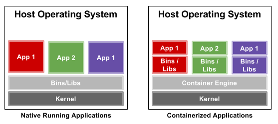

class: middle, center

# Getting Started with Kubernetes

---

# Agenda

- Kubernetes overview
	* Containers overview
	* Kubernetes architecture
- Kubernetes concepts (and a lot of YAML)
	* Pods
	* ReplicaSets
	* Deployments
- Networking in Kubernetes
- Services

---

# To understand Kubernetes, we must first understand 2 things

- Containers
- Orchestration

---

class: middle, center

# What are containers?

--

- Made up of Linux primitives
	* Cgroups
	* Namespaces
	* Blah blah blah

???
Namespaces - control what a process can use.
Cgroups - control what a process can use.

--

- Isolated environments
- As in, they can have their own processes, networks, mounts. Just like VM
- Except they can share the same kernel

.center[]

--

Linux containers have been around long before Docker

- OpenVZ
- LXC
- rkt
- runc
- ...

---

class: middle, center

# Why do you need containers?

--

- Compatibilities, dependencies
- Quick, repetable
- Consistency

---
